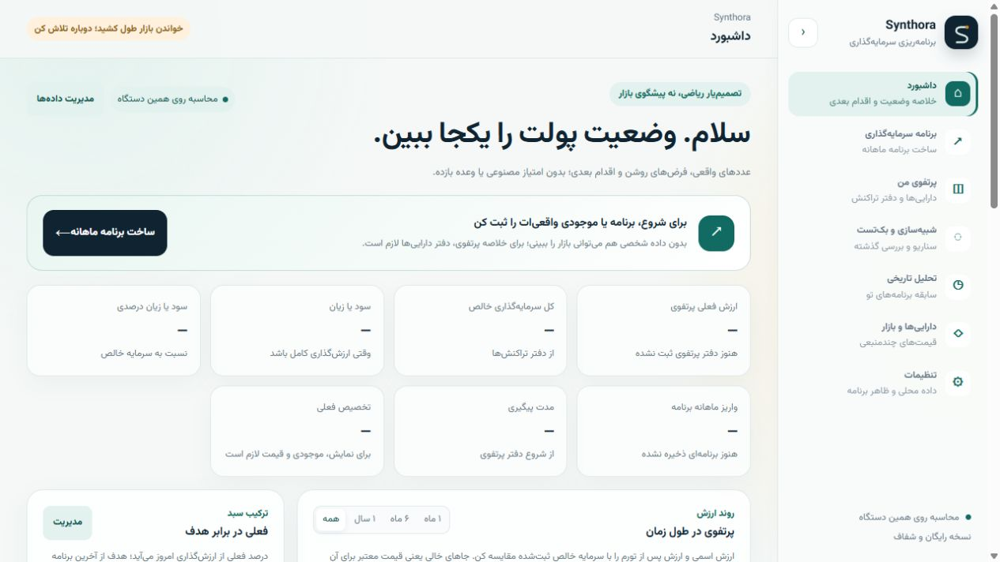
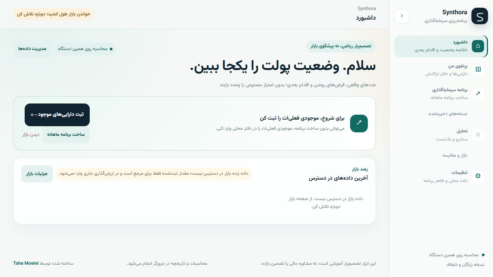
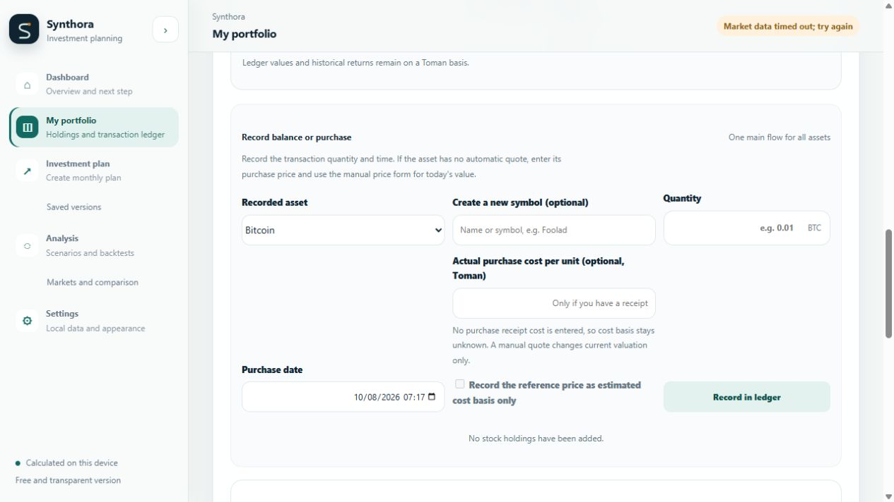
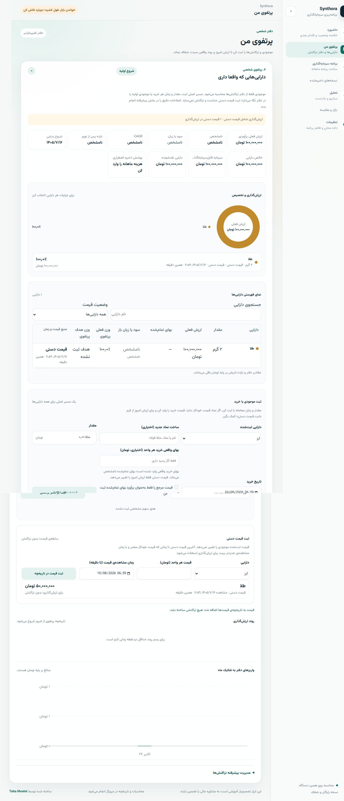
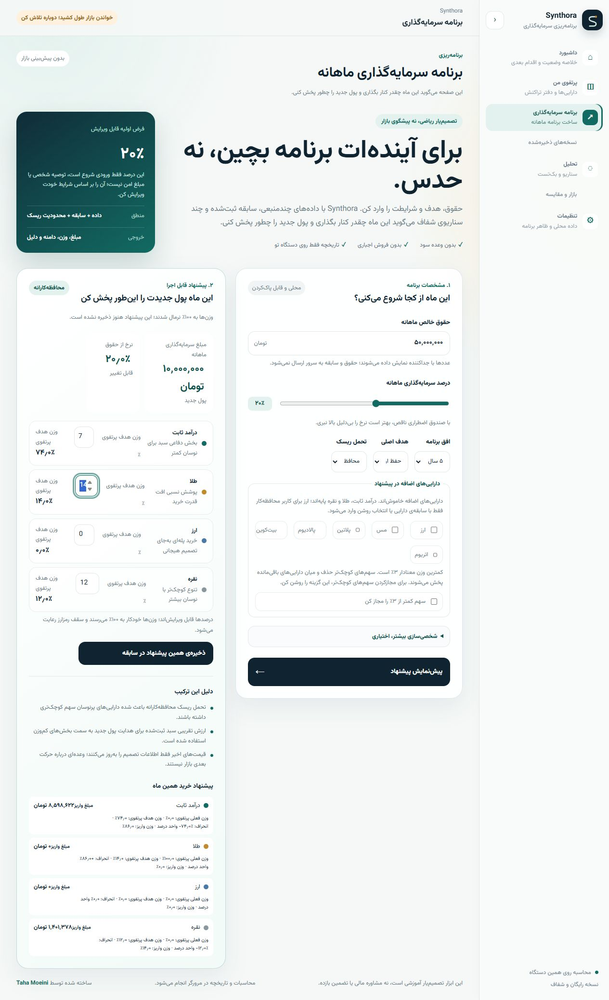
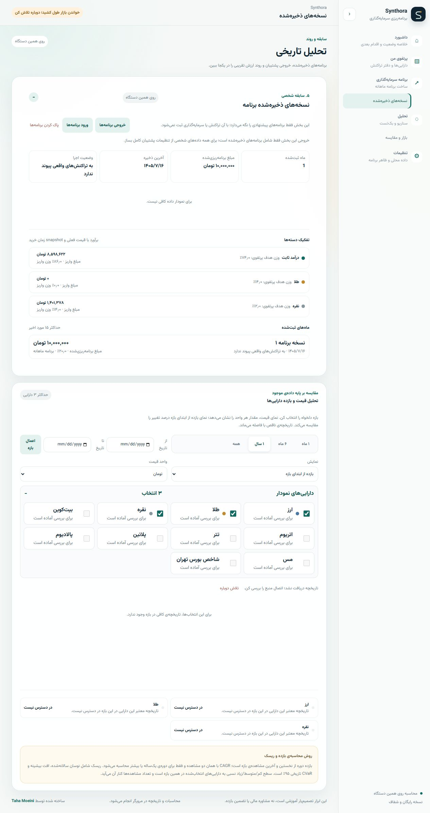
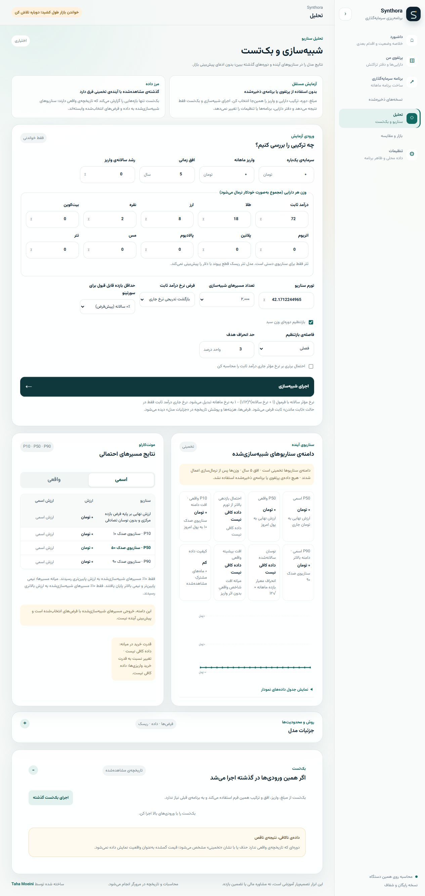
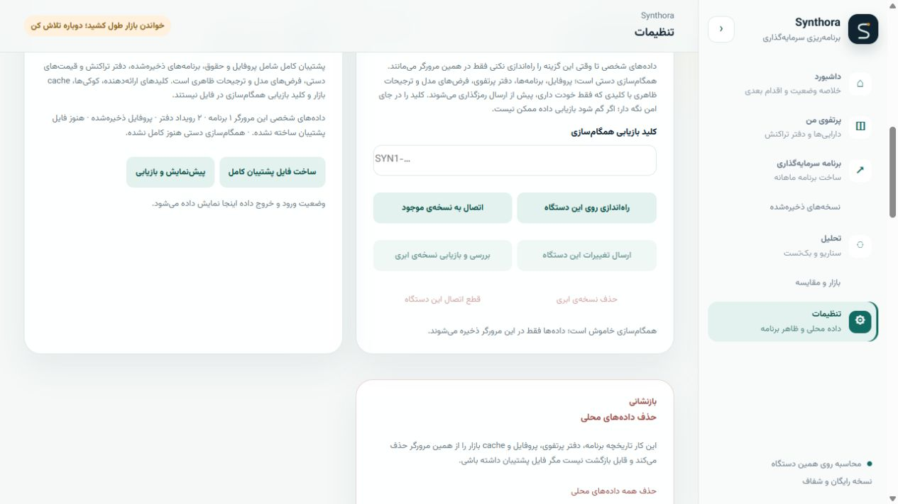

# UX and financial-trust fixes — October 2026

This record describes the verified findings and implementation in the `ux-financial-trust-fixes` change. Current behavior is defined by the source and tests in this checkout; screenshots and browser observations are local QA evidence, not market data.

## Finding matrix

| #   | Finding                                                                                    | Status                                                     | Verified outcome                                                                                                                                                                                                                                                                                                                                                                  |
| --- | ------------------------------------------------------------------------------------------ | ---------------------------------------------------------- | --------------------------------------------------------------------------------------------------------------------------------------------------------------------------------------------------------------------------------------------------------------------------------------------------------------------------------------------------------------------------------- |
| 1   | Decimal inflation assumptions rejected by whole-number controls                            | Verified/fixed                                             | Shared assumption inputs accept deliberate decimal precision. Simulation and Settings defaults submit unchanged; fetched and restored values are range-checked, and invalid entries receive localized field errors.                                                                                                                                                               |
| 2   | Saved proposals appear as actual investments                                               | Verified/fixed                                             | Plan history records amount, target and contribution mixes, creation/version, and `not-linked` execution state. Saving and importing a plan do not append ledger events or create invested capital. Legacy plans normalize to `not-linked`.                                                                                                                                       |
| 3   | Target and contribution weights share an ambiguous denominator                             | Verified/fixed                                             | Plan results expose current weight, target weight, contribution amount, contribution weight, and deviation in percentage points separately. A 10,000,000 Toman contribution reconciles to the budget using whole-Toman rounding; the 100% gold holding versus a 14% gold target reports +86 pp drift and can receive no new contribution.                                         |
| 4   | Inferred opening values are presented as purchase cost                                     | Verified/fixed                                             | Opening quantity, starting tracking value, and acquisition basis are separate. Basis is confirmed, estimated, mixed, or unknown. Quantity-only holdings can be valued but do not show confirmed profit; receipt cost is entered as an audited basis correction.                                                                                                                   |
| 5   | Foreign-asset quantities show Toman or USDT                                                | Verified/fixed                                             | The entry form and holdings use canonical units: USD, BTC, ETH, USDT, grams, or Toman as defined by the asset. Existing foreign-currency ledger quantity is USD; only its displayed unit label was wrong, so no quantity migration was made. Prices and ledger amounts remain Toman.                                                                                              |
| 6   | Quote quality is lost in portfolio totals and recommendations                              | Verified/fixed; existing missing-price safeguard preserved | Accepted, accepted-estimate, stale, manual, unavailable, and rejected-conflict states carry provenance and eligibility into valuation and labels. Estimates remain labeled; unavailable/conflicted observations cannot produce a complete total. Partial provider results do not read as complete live coverage.                                                                  |
| 7   | Holding correction action does not open the editor                                         | Verified/fixed                                             | The asset-scoped drawer opens with correction, receipt-cost, and manual-quote actions. The selected asset is carried into the form, focus moves to the relevant field, and cancel restores the holding context. Corrections remain auditable.                                                                                                                                     |
| 8   | First-use dashboard shows empty analytics before a useful action                           | Verified/fixed                                             | New, plan-only, holdings-only, missing-price, and returning states have contextual actions. A new user can add an existing holding without first creating a plan; analytics are gated by available data.                                                                                                                                                                          |
| 9   | Section navigation does not follow browser history                                         | Verified/fixed                                             | Hash routes support Back/Forward, refresh, deep links, legacy section links, and retained selection/scroll context. Locale changes preserve the selected route.                                                                                                                                                                                                                   |
| 10  | Saved state or locale flashes as empty/default during startup                              | Verified/fixed                                             | A stable hydration shell waits for persisted profile, settings, plans, and ledger before rendering conclusions. Restore and refresh retained the existing records. Corrupt or unsupported data reports recovery guidance without silently deleting stored values.                                                                                                                 |
| 11  | Transaction failures are distant or generic; dates can become invalid while a form is open | Verified/fixed                                             | Primary and advanced forms show localized inline errors linked to the affected field and preserve input. Empty dates reach custom validation; oversell identifies the dated quantity problem and creates no event. A passed default minute alone is not treated as an error.                                                                                                      |
| 12  | Backtest history failure provides no recovery path                                         | Verified/fixed                                             | Failure output identifies required frequency, requested duration, per-asset ranges, overlap, and the actual limitation. A shorter period or mix is offered only when supported continuous history exists; otherwise the absence of a supported option is explained.                                                                                                               |
| 13  | Export scope and protection status are unclear                                             | Verified/fixed; restore/data-loss defect not reproduced    | Plan-only export and full personal-data backup are named separately. Full backup states included/excluded records, import replacement effects, and unknown browser-download completion. A full export/restore round trip succeeded in isolated browser storage; malformed-import tests preserve existing data.                                                                    |
| 14  | Monthly portfolio buckets and labels can disagree across calendars                         | Verified/fixed                                             | Reporting buckets use Gregorian month boundaries in UTC and format labels from those boundaries with an explicit Gregorian calendar for each locale. Boundary tests preserve event totals across October/November.                                                                                                                                                                |
| 15  | Navigation and planning expose too much complexity at once                                 | Verified/fixed                                             | Main sections are Home, Portfolio, Plan, Analysis, and Settings. Saved versions live with Plan; ledger/performance with Portfolio; markets, scenarios, and backtests with Analysis. Basic inputs precede advanced controls. The salary percentage is described as an editable preview assumption, not advice.                                                                     |
| 16  | Mobile journeys overflow or hide portfolio detail                                          | Verified/fixed in viewport emulation                       | Compact holdings cards and responsive forms were checked at 360×800, 390×844, 430×932, 768×1024, 844×390, and 932×430; no unintended root horizontal overflow was found. Real-device keyboard occlusion was not tested.                                                                                                                                                           |
| 17  | Desktop columns and numeric units clip at common widths                                    | Verified/fixed in viewport emulation                       | Portfolio and plan controls were checked at 1280, 1366, and 1440 px. Table/source fields fit their layout, numeric units remain together, and unavailable charts show useful status or next steps.                                                                                                                                                                                |
| 18  | English UI contains mixed-language units and inconsistent financial wording                | Verified/fixed; catalog runner unavailable                 | English units, cost-basis labels, navigation, and event names were corrected; Persian remains the base/fallback and matching catalog entries were added for English, Russian, and Chinese. English and Persian journeys were exercised. Full localization test execution is blocked by the missing `espree` package.                                                              |
| 19  | Dialogs, fields, and charts are difficult to use accessibly                                | Verified/fixed in source and browser checks                | Blocking drawers use dialog semantics; keyboard Tab and Shift+Tab stay inside the holding dialog, Escape closes it, and focus returns to the selected holding. Field errors are programmatically associated; charts expose summaries and accessible detail rather than hundreds of points; status is not conveyed by color alone. A screen reader was not available for this run. |
| 20  | Failed or repeated operations can lose input or duplicate records                          | Verified/fixed in targeted journeys                        | Invalid submissions retained input and created no transaction; plan saving is explicit and disables duplicate submission while in progress; persistence writes are batched. A public market request timed out in the test browser and showed an affected-market message; no latency or real-offline claim is made.                                                                |

### Additional audit checks

| Check                                                                        | Status         | Evidence                                                                                                                                                                                                                                         |
| ---------------------------------------------------------------------------- | -------------- | ------------------------------------------------------------------------------------------------------------------------------------------------------------------------------------------------------------------------------------------------ |
| Missing or rejected price disappears from a claimed complete portfolio total | Not reproduced | Existing aggregation withheld the complete total when a required holding price was unavailable. The safeguard remains covered by deterministic portfolio tests.                                                                                  |
| Importing a saved proposal manufactures an executed holding                  | Not reproduced | Plan save, plan-only import, and full-backup restore preserve the plan as `not-linked`; the ledger event count and amount remain independent.                                                                                                    |
| Full backup restore silently loses supported data                            | Not reproduced | A full backup restored into isolated browser storage, then survived refresh with profile, one plan, two ledger events, manual quote, and receipt-backed cost basis. This is a tested path, not a claim that every browser download is protected. |
| Quantity-only or ambiguous legacy cost becomes confirmed actual cost         | Not reproduced | New quantity-only entries have unknown basis; normalization defaults missing legacy provenance to unknown. Existing explicit confirmed values remain as recorded.                                                                                |

## Compatibility and accounting decisions

- No SQL migration was needed. History export schema is version 4, plan record version is 1, portfolio schema is version 3, and full personal backup schema is version 1. Existing normalizers accept supported legacy data; imports validate before batched writes. No applied migration was edited and no destructive migration was added.
- Legacy plan records are retained as proposals and normalized to `executionStatus: "not-linked"`; they are never interpreted as executed transactions.
- Legacy ledger events without explicit cost provenance normalize to unknown basis. They are not promoted to confirmed cost because an old record contains a price field whose meaning may have been inferred.
- Existing sale accounting was not changed: sale proceeds reduce net invested amount and do not create tracked cash. The portfolio UI and README now state this behavior. Changing the treatment requires a separate product decision.
- Partial plan execution is still not linked to saved plans. Product design must define how partial fills, corrections, and reversals should be represented before adding that link.
- Portfolio health timelines, explainable recommendations, and a consolidated data-health center remain future product decisions. This change does not introduce them.

## Browser evidence

The screenshots below are local QA captures. Portfolio examples use manually entered test records (2 g gold, a 50,000,000 Toman manual quote, and an 80,000,000 Toman receipt basis); they are not seeded product data or provider quotes.

| Before/after or journey                   | Capture                                                                                                                                                     |
| ----------------------------------------- | ----------------------------------------------------------------------------------------------------------------------------------------------------------- |
| Dashboard onboarding, before              |                                                                  |
| Dashboard onboarding, after               |                                                                    |
| Mobile onboarding and holdings            |           |
| Canonical English units                   |                                                                                     |
| Uncertain quote and correction editor     |   |
| Allocation results and saved plan history |                 |
| Simulation defaults and backup scope      |         |

## Verification and limitations

- `npm run check`, `git diff --check`, and JSON parsing of all four locale catalogs passed. Direct execution of the 23 `tests/*.test.js` files produced 180 passing tests and two failing assertions in `tests/market.test.js`: MetalCharts expected 5 quotes but received 4, and Tindex expected 3 index sources but received 2. Both assertions failed identically against a pre-change snapshot. The localization file could not load because `espree` is missing.
- `npm test` could not start its worker processes in this sandbox (`spawn EPERM`). `npm run lint` and `npm run format:check` could not run because `eslint` and `prettier` are not installed in the checkout. The localization test also cannot import missing `espree`. `package.json` defines no build or type-check command.
- Browser checks covered Persian and English first-use, quantity-only holding, manual quote and restored valuation, receipt-cost correction, monthly plan and saved history, refresh/return, missing-price and timeout states, oversell/invalid-date/invalid-amount recovery, isolated full backup restore, and Back/Forward/deep links. Automated viewport emulation covered the sizes listed above.
- No real-device keyboard occlusion, screen-reader run, physical-device rotation, or controlled offline/latency measurement was available. These remain unverified.

## Release-assurance follow-up — 2026-10-08

| Area                              | Status              | Result                                                                                                                                                                                                                                                                                                                                                                                                                                                                                                                       |
| --------------------------------- | ------------------- | ---------------------------------------------------------------------------------------------------------------------------------------------------------------------------------------------------------------------------------------------------------------------------------------------------------------------------------------------------------------------------------------------------------------------------------------------------------------------------------------------------------------------------- |
| Market provider coverage          | Verified/fixed      | Both historical failures came from omitted aggregation inputs: fulfilled MetalCharts quotes and the optional Tindex index quote were dropped before source counts. The deterministic fixture expectations were correct; both quotes now enter the shared aggregation.                                                                                                                                                                                                                                                        |
| Localization and toolchain        | Verified/fixed      | `npm ci` restored the lockfile-declared development tools without changing package manifests. The localization test uses Windows-safe file URLs, and the standalone “dollar” and “unit” copy has translations in all supported catalogs.                                                                                                                                                                                                                                                                                     |
| Muted-text contrast               | Verified/fixed      | Light muted text measured 4.01–4.45:1 on the tested page, control, and soft surfaces; chart labels measured 3.08:1 on the page background. The reviewed light muted and chart-label color is now `#5c6d79` (minimum 4.64:1 across those surfaces). Dark muted and chart labels remain at least 5.40:1 across tested dark surfaces. Regression coverage checks both themes.                                                                                                                                                   |
| Production version                | Verified separately | Public HTML matches merged `origin/main` after removing the two Cloudflare-injected scripts; the deployed app, style, navigation, state, portfolio, history, and engine asset hashes match the merge commit.                                                                                                                                                                                                                                                                                                                 |
| Production journey smoke          | Not complete        | In the available in-app browser, direct `#portfolio` and legacy `?view=portfolio` URLs rendered Dashboard. The first-use “Add existing holdings” action did not navigate; section clicks changed content without updating the URL, and Back left the app. Loading copy in all four languages remained visible alongside the rendered dashboard. The live unavailable-index state remained explicit. The cause of the route mismatch was not isolated, so production completion must not be claimed from source hashes alone. |
| Screen reader and physical device | Unavailable         | The browser accessibility tree was inspectable, but no screen-reader app or physical mobile device was exposed. Real keyboard occlusion, rotation, and spoken chart/dialog behavior remain unverified.                                                                                                                                                                                                                                                                                                                       |
| Automated checks                  | Passed              | `npm test` passed all 192 tests; `npm run lint`, `npm run format:check`, `npm run check`, and `git diff --check` passed. The lockfile toolchain was restored with `npm ci`; no package manifest changes were made.                                                                                                                                                                                                                                                                                                           |
| Deferred product decisions        | Still deferred      | Partial plan execution, portfolio-health timelines, explainable recommendations, and a consolidated data-health center were not changed.                                                                                                                                                                                                                                                                                                                                                                                     |

The merge record above remains a snapshot of the original implementation run. Current check results are recorded in the follow-up pull request description.
